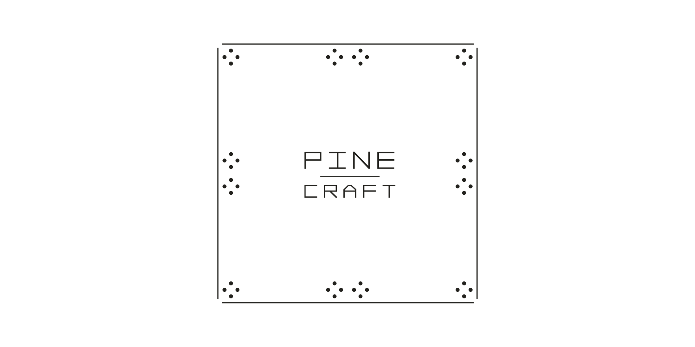
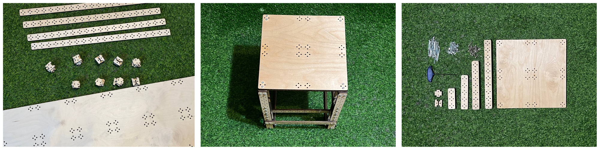
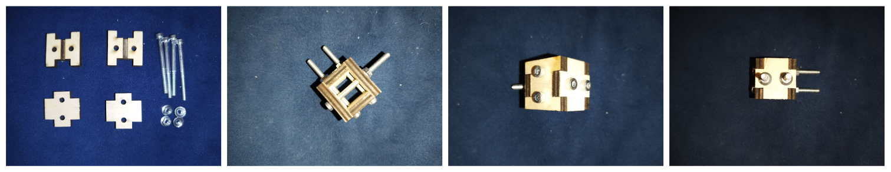
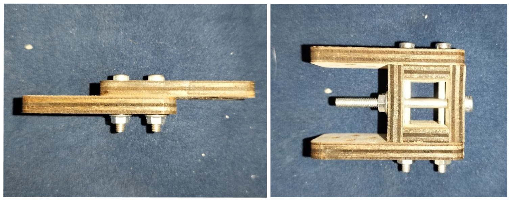
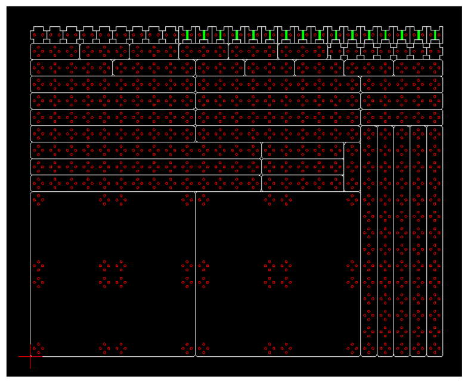

# Pine Craft: open-source generative constructor

## About

Pine Craft is a constructor created for solving everyday tasks. Its key features are versatility, minimalism and simplicity of use.

Its scope of application includes DIY projects, furniture making, home repairs, life hacks. In addition, it can be used to teach children construction design and robotics. Also, Pine Craft can be successfully used in startups and laboratories for making prototypes and fixtures.

Pine Craft is very simple in manufacturing and usage. It requires a minimum of tools for assembly. The constructor is quickly assembled, and if necessary, it can be easily disassembled into parts for reuse.

Pine Craft is suitable for use at home, as it is based on eco-friendly material - pine plywood.

This repository contains a set of utilities for self-manufacturing Pine Craft parts, as well as detailed instructions for using this constructor.

Watch this short video to learn how you can build with the Pine Craft:

[](https://www.youtube.com/watch?v=A3GeZmPa8k8 "Pine Craft Promo")

## Examples

You can find sample layout generations under `examples` folder. There are:
1. `simplest` - minimal viable example
2. `stool_kit` - a set of parts to assemble a stool
3. `universal_kit` - basic starter kit to manufacture if you want to play around with the Pine Craft

Examples of items made of Pine Craft can be found here:

- [docs/examples.md](docs/examples.md)



## Set of parts

### Beams and plates

- The Pine Craft constructor consists of parts made of plywood on a laser cutter and screws to fasten them together.
- Parts have a rectangular shape and their dimensions are multiples of the base segment size - `unit_size`.
- Holes for connecting parts form a pattern that repeats with the `unit_size` step
    - One element of the pattern consists of 4 holes evenly distributed in the circle with the diameter of `unit_size/2`.
        - This arrangement of holes allows you to connect parts along and across
        - The `unit_size/2` diameter of the circle allows you to connect parts with a half step

In practice, it is convenient to classify Pine Craft parts by their shape:
1. 1x1-sized parts are called spacers
2. linear parts with an aspect ratio of 1xN are called beams
    1. recommended beam sizes are: 1x2, 1x3, 1x5, 1x7, 1x10, 1x14, 1x20
    2. short beams - up to 1x5 - are used mainly for connecting parts
    3. long beams - 1x10, 1x14, 1x20 - are used to create the frame of the structure
3. rectangular parts are called plates
    1. recommended plate sizes are: 2x2, 2x3, 10x10, 10x15, 10x20, 10x30
    2. small plates - 2x2, 2x3 - are needed to connect parts
    3. large plates - 10x10 and larger - serve as working surfaces of products (shelf, seat, etc.)

### Cubes

"Cubes" are used to connect parts in space. The cubes are assembled from two pairs of parts and are held together by the grooves and the tightening force of the screws.



### Screws and nuts

To connect Pine Craft parts, it is recommended to use M4 screws of two main lengths:
1. 20 mm - allows you to fasten 2 parts together
2. 50 mm - allows you to fasten together 7 parts, or one cube and two parts on both sides of it



I use hexagon head screws, as they wear out less when reused and have a lower chance of tearing them off when tightening.

For M4 screws, a hex key with a side of 3mm is suitable. It is better to take a hex key with a convenient handle, since you will have to tinker a lot of screws :) And even better to buy a compact screwdriver!

It is better to use nuts with a flange - in theory they should cling better to the plywood and prevent unscrewing. To support the nuts, you can use a 7 mm wrench, but in fact, you can do without it.

Here is the bill of materials for screws and nuts:
1. DIN912 4x20 screw
2. DIN912 4x50 screw
3. Nut with flange DIN6923 m4

## Scale

The standard dimensions of the constructor are adapted to the dimensions of structures 0.5-2 m and loads of 10-100 kg. These parameters are calculated for reasons of human use in everyday life.

Here are the default dimensions:
1. The `unit_size` is 30x30 mm
2. Plywood thickness is 6 mm
3. Screws are M4

However, all the dimensions of the constructor can be customized for your purpose.

## Manufacturing

Pine Craft is recommended to be made of pine plywood, as it is a durable and eco-friendly material. It is not recommended to use plastic, acrylic, as well as chipboard materials.

For manufacturing, it is recommended to use a laser cutter, not a milling cutter, since it is faster and utilizes the sheet completely because no technical clearances between parts are needed.

You can use a built-in utility `pine-craft place-parts` to create a cutting layout in the .dxf format. This utility only supports laser fabrication, as it neglects the gaps between the parts. This is done intentionally, as it allows you to optimize the cutting length by an average of 25% since the contours of neighboring parts are cut simultaneously. The manufacturing time is also reduced by a quarter. With a laser cut width of about 1mm, this optimization does not harm the geometry of the constructor.

Here is the example of the auto-generated cutting layout. It contains parts needed to make a [stool](docs/examples.md):



It is important for beams to have holes along the entire length, but this is not necessary for plates. A large number of holes greatly increases the cutting time - not only due to the length of the cut, but also due to the loss of time on moving the machine head between the holes. Therefore, it is recommended to use a sparse pattern for plates.

In practice, only the holes on the edges of the plate are used. However, I also prefer to leave holes in the center for aesthetic purposes.

Cutting layout has 3 colors: black, red and green. Black is used for contours of parts, red is for holes and green is for grooves. In .dxf these colors have numbers: black - 7, red - 1, green - 3.  

> In dxf color 7 is used for both black and white. That's why contours are white in the picture :)

Grooves are needed in cube parts to give screws space. They should be 0.1-0.2 mm deep. To manufacture grooves, you should set the laser cut in engraving mode and let in engrave green polygons. You will need to find the appropriate power and speed to achieve the desired depth as it depends on the laser cutter. Try it on a small piece of plywood before cutting the main layout.

It's important to cut everything in the right order:
1. cut holes and make grooves
2. cutout parts

This order is needed because after the part is cut out, it can displace itself, so the holes cut after that will be misaligned.


## Command line tool

### Installation

Tested on Ubuntu 20.04. Should support Ubuntu/Debian out of the box, but for other Linux distributions may require tweaking. It's a Python3 program anyway, so it can be theoretically started on Mac/Windows, but you may need to change the code :)

#### Install globally

1. Put this directory to the place where all your programs live. Do not move it after installations or links will break!
2. Enter the directory `cd pine_craft`
3. Run script `./install.sh`. What it does:
   1. installs packages `python3.9` and `python3.9-venv` 
      1. (if you want to use it with different version of python, you can edit `install.sh`. However, I tested it only with `python3.9`)
   2. creates virtual environment `venv` in directory `pine_craft`
   3. installs argcomplete globally - [like that](https://pypi.org/project/argcomplete/#activating-global-completion)
   4. creates executable `/usr/bin/pine-craft` pointing to the `./pine-craft.py`
4. Restart your shell to make autocompletion work
5. Run `pine-craft --help`

#### Uninstall

1. Remove python3.9 if you do not need it (which is unlikely) - `sudo apt-get uninstall python3.9 python3.9-venv`
2. Remove python auto-completion if you do not need it (but better do not do it, because other programs may use it)
    ```
   # depends on where it is placed on your file system:
   rm /etc/bash_completion.d/python-argcomplete
   rm ~/.bash_completion.d/python-argcomplete
   ```
3. Remove executable `sudo rm /usr/bin/pine-craft`
4. remove virtual env directory `cd pine_craft; sudo rm -r venv`

#### Run without installation

```bash
python3 ./pine-craft.py --help
```

or

```bash
alias pine-craft="python3 ./pine-craft.py"
pine-craft --help
```

You may need to install additional packages to your Python via `python3 -m pip install -r requirements.txt`.

If you don't want to install them globally - create a virtual environment!

```bash
python3 -m venv venv
venv/bin/pip install --upgrade pip && venv/bin/pip install -r requirements.txt
venv/bin/python3 ./pine-craft.py --help
```

> If you are not familiar with Python, virtual environment is just a regular directory, where all the libraries will be installed.  So, to uninstall everything all you need is to delete the folder :)
> 
> You can read about venv [here](https://docs.python.org/3/library/venv.html).

### Usage

Utility `pine-craft` has 4 sub-utilities:
1. `gen-box` - generate parts for `Cubes`
2. `gen-part` - generate regular parts
3. `place-parts` - generate optimal cutting layout from parts. Reads config from `.yaml` file
4. `cut-length` - compute total curves length in a `.dxf` file

Each utility has its own help: `pine-craft gen-box --help`

Examples of usage are placed under the `examples` folder.