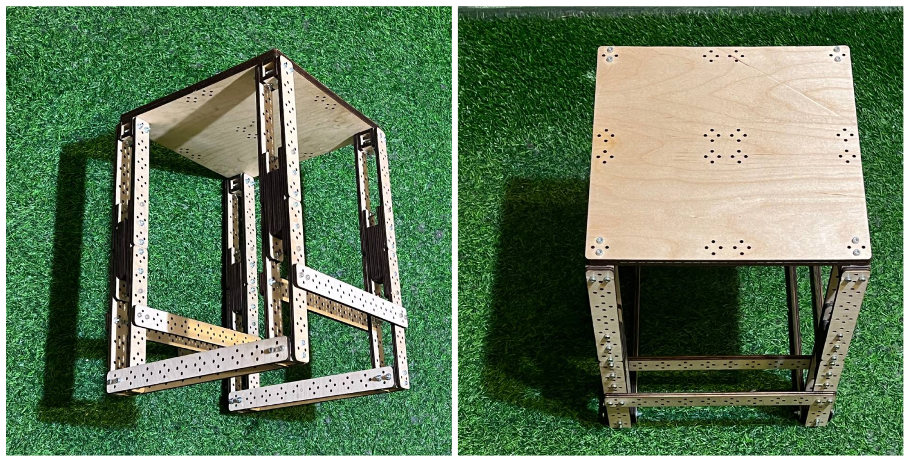
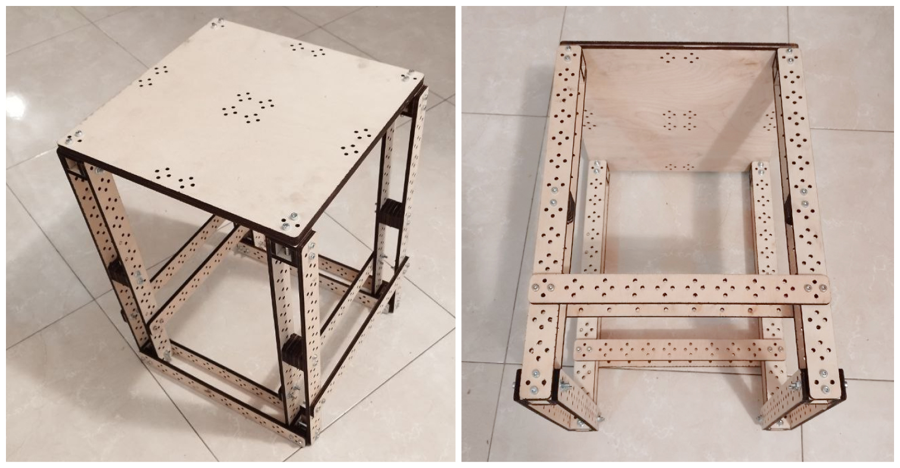
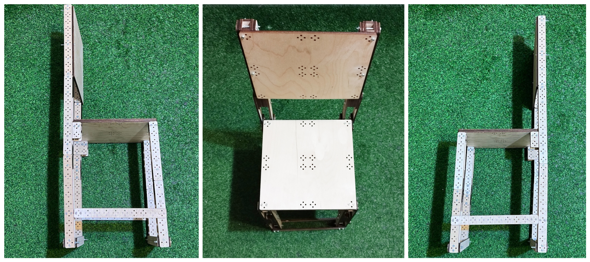
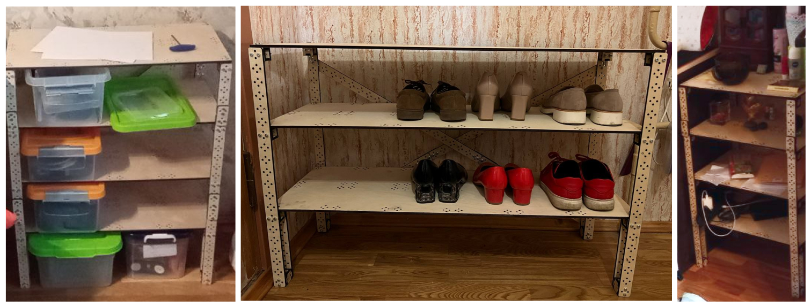
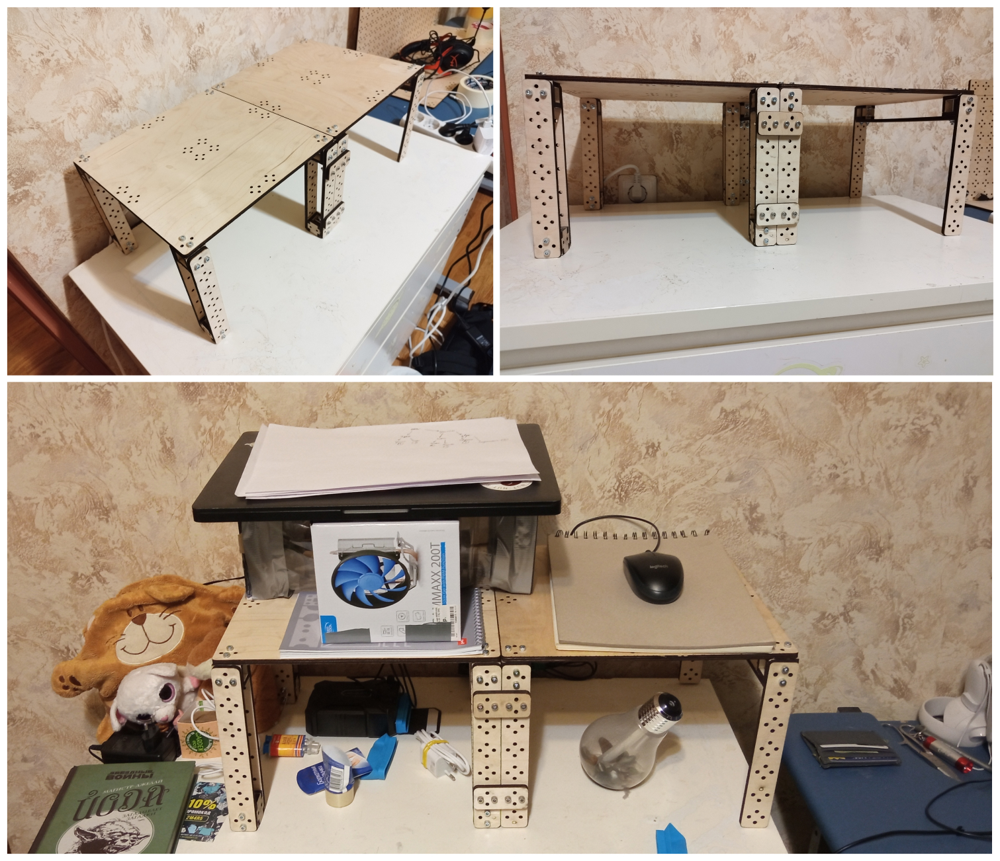
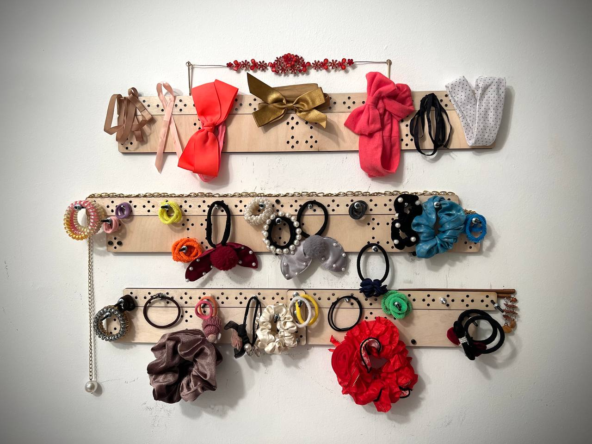
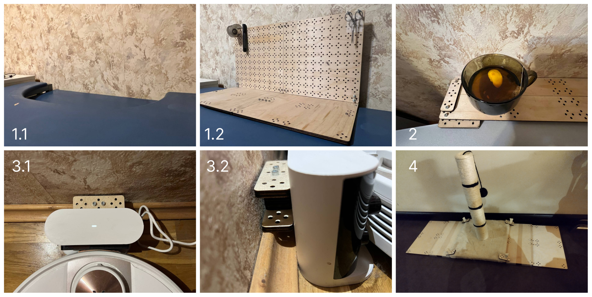
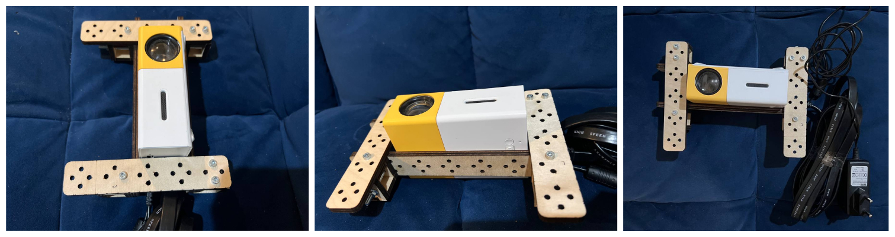
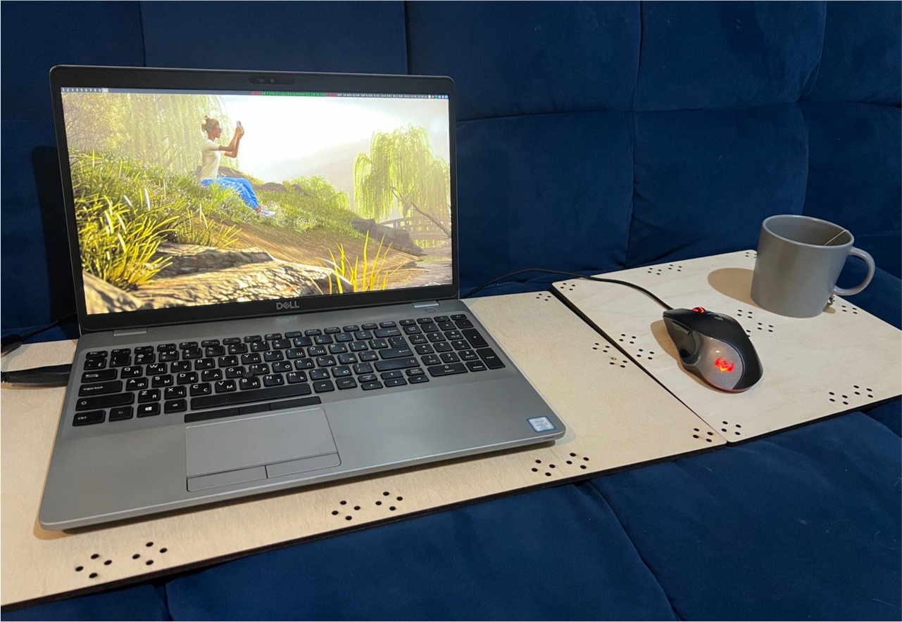

## Pine Craft in action or Just add some screws :)

### Stool

This stool is one of my first designs from Pine Craft. I have special feelings to it for its simplicity and elegance. The stool turned out to be very durable, you can not only sit on it, but also step up with your feet to explore the upper shelves :)

### Stool v2

Improved version with longer beams for legs.

### Chair

If you add a back to the stool, you will get a chair! The rigid back helps to keep your posture, and also serves as an excellent clothes hanger :)

### Racks

It is especially easy to make racks from Pine Craft. On the left there is a rack for containers with tools, in the middle there is a shoe rack, and on the right there is a rack for small things:

### Shelf over the commode

The surface of the commode can be increased if you put such a shelf on it.

### Cute accessories holder

Add some Pine Craft to your boring white wall :)

### Life Hacks

1. In a rented apartment there was a computer desk with a very uncomfortable cutout for a monitor. I had to modify it a little...

2. The design of the bed was poor as well. Instead of having a flat headboard so that the bad could be pushed tightly against the wall, for some reason it had arched one. As a result, there was a large gap in which things were constantly falling through. However, it was not so difficult to fix it)

3. The baseboard prevented moving the charging station of the robot vacuum cleaner to the wall, and every time the robot arrived at the base, he tilted it and as a result could not recharge. A small spacer from the constructor corrected the situation.

4. After relocation, we bought a temporary scratching post for our cat. However, it turned out to be very unstable - when the cat was leaning on it with the whole mass, it would turn over. Pine Craft plates added the necessary weight and support area to the base of the scratching post. The cat is happy :)

The projector stand allows you to direct its beam vertically upwards. Oh yeah, now you can watch your favorite movies right on the ceiling!

Some parts of the constructor are useful on their own, even without assembly. For example, long beams can be used to get objects out from under the bed, and the plates work great as a laptop base!

